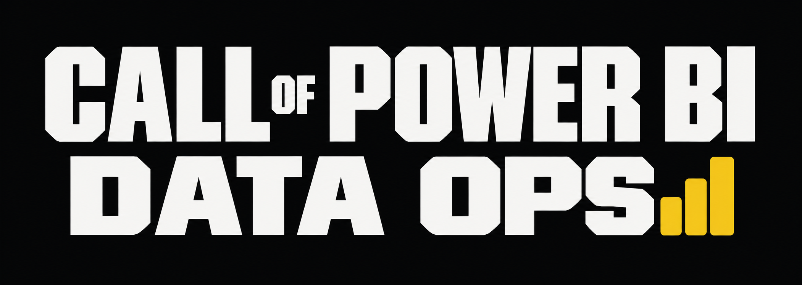

# Call of Power BI: Data Ops



Short name: `copbi-dops`. Unofficial parody title, not affiliated with Activision or Microsoft.

First-person shooter implemented as a Power BI custom visual (TypeScript, three.js). It ships in a PBIP project for Power BI Desktop on Windows. All art and sound are generated in code; no external file is loaded.

This project is inspired by Call of Duty: Black Ops 6, Call of Duty: Modern Warfare (2019), and Call of Duty: Modern Warfare II (2022).

> [!WARNING]
> **Do not monetize this project.** The title is a parody that refers to third-party trademarks ("Call of Duty" belongs to Activision, "Power BI" to Microsoft). Selling it, putting it behind a paywall, running ads on it, or publishing it on a store can trigger takedowns and copyright or trademark strikes against you.
>
> **Do not take it as your own.** This project belongs to its author. Do not republish it under your name or remove the credits.
>
> It is free and its source is available so that anyone can test it and learn from it. The license (PolyForm Noncommercial 1.0.0) forbids commercial use.

## Requirements

- Power BI Desktop 2.152 (tested with this version). The visual targets `powerbi-visuals-api` 5.11.1.
- Node.js 20.19 or later (developed with 26.7).
- Google Chrome, only for `npm test`. Set `CHROME` if it is not at `C:/Program Files/Google/Chrome/Application/chrome.exe`.

## Install

```bash
cd visual
npm install
```

## Usage

Open the project:

1. Open `copbi-dops.pbip` in Power BI Desktop.
2. Click `Refresh` once. The model has no cache, so the `Weapons` table is empty until the first refresh.
3. Click the visual, then press `1`, `2` or `3` (or click a mode).

Build and embed a new version of the visual:

```bash
cd visual
npm run package
```

`npm run package` increments the last number of the version in `visual/pbiviz.json`, runs `pbiviz package`, writes `visual/dist/<guid>.<version>.pbiviz`, and unzips it into `copbi-dops.Report/CustomVisuals/<guid>/`. Close the report and reopen the `.pbip` afterwards. Desktop caches custom visuals by GUID and version, so a rebuild with an unchanged version is not reliably picked up. `npm run package:only` builds without bumping or embedding.

Standalone page with real mouse lock: `npm run package` also writes `visual/dist/copbi-dops-standalone.html` (one file, no server needed). Open it in a browser. Outside Power BI there is no iframe sandbox, so a click requests a real Pointer Lock (Esc releases it). It uses the built-in roster, keeps best scores in `localStorage`, and accepts `?look=capture|drag|joystick` and `?diag`. Power BI offers no setting that grants Pointer Lock to a visual; inside Power BI the capture is emulated.

Other commands (run in `visual/`):

| Command | Effect |
|---|---|
| `npm run lint` | ESLint with `eslint-plugin-powerbi-visuals` (recommended rules). |
| `npm run typecheck` | `tsc --noEmit`. |
| `npm run test:standalone` | Loads the standalone page as a top-level page in headless Chrome and checks capture, view turning and release. |
| `npm test` | Rules test, then a headless Chrome scenario that loads the packaged visual in an `<iframe sandbox="allow-scripts">` with a stub host. |

Controls:

| Input | Action |
|---|---|
| `W A S D` / `Z Q S D` | Move. Keys use physical positions. |
| Click in the game (default `Capture` mode) | Captures the mouse: the cursor is hidden and moving the mouse turns the view, no button held. Leaving the visual releases it. |
| Left button | Fire, with or without ADS (`Capture` mode). |
| Drag with the left button | Look (`Look mode` = Drag). |
| Cursor offset from the center | Look (`Look mode` = Joystick). No button held. A dashed ring shows the dead zone. |
| `F` | Fire. |
| Click (no drag) | Single shot. |
| Right button (held) or `E` | Aim (ADS). The left button fires while aiming. Aim time depends on the class (0.11 s pistol to 0.26 s sniper). Aiming or firing stops a sprint. |
| `R` | Reload. |
| `1` to `9`, wheel | Switch weapon. |
| `X` | Quick turn of 180 degrees. |
| `Shift` + direction | Sprint in any direction (slower backwards). |
| `C` | Crouch (hold). While sprinting: slide (speed boost that fades over 0.8 s, steerable). During a slide: `C` cancels it and keeps the momentum. |
| `Space` | Jump. During a slide: jump that keeps the slide speed. |
| `Tab` or `B` | Scoreboard while held. |
| `M` | Back to the mode menu. |
| `C` (menu), click a class | Pick a class: `ALL WEAPONS` (every row of the table on `1` to `9`) or `CLASS 1` to `CLASS 5` (primary on `1`, secondary on `2`, one perk). |
| `V` (menu), `EDIT CLASS` | Edit the selected class with the arrows: primary (non-pistol rows), secondary (pistol rows), perk. Saved in the report (`loadouts` object). |
| `N` (menu) | Next map: Yard, Quarry (open, long sight lines), Blocks (streets and buildings), Cargo (36 m container yard), Derrick (desert pit, off-center tower with three levels, pipelines, sheds with windows). Saved in the report. |
| `D` (menu) | Bot difficulty: easy, normal, hard, veteran. Saved in the format pane setting. |

Time to kill (TTK): the time from the first hit on a bot to its death. It appears in the kill feed, the HUD (`AVG TTK`) and the end-of-round summary (average and best). In Aim Range the same slot measures reaction time: from a target rising to the hit. The best TTK is persisted (3 kills or more).

Modes: Aim Range (60 s, static and moving targets), Bot Duel (first to 5, bots peek, shoot and take cover), Survival (waves, health regenerates).

Perks: Steady Aim (hip-fire spread -35%), Quick Hands (reload 30% faster), Quickdraw (aim 30% faster), Lightweight (move and sprint 8% faster), Scavenger (+50% reserve ammo). A class weapon that the slicer filters out is replaced by the first matching row.

## Power BI data

Model table `Weapons` (inline `#table`, 8 rows): `Weapon`, `Class`, `Damage`, `FireRate`, `Magazine`, `ArmorPen` (fraction), `RecoilIndex`. Calculated columns on the same table: `Pellets`, `Shots To Kill`, `TTK (ms)`, `DPS`, `Helmet One-Shot`. They use the same formulas as `visual/src/rules.ts`; `visual/test/rules.test.mts` pins the numbers.

Data roles of the visual: `Weapon`, `Class`, `Damage`, `Fire rate (RPM)`, `Magazine`, `Armor pen %`, `Recoil index`. Without data, the visual falls back to a built-in roster.

- The `Class` slicer on page `Range` filters the rows, which replaces the loadout. The round continues.
- Equipping a weapon calls `selectionManager.select` with the selection ID of that `Weapon` row. The cards and the table on the same page cross-filter. The slicer and the game ignore each other (`NoFilter` interactions).
- A headshot kills a helmeted bot in one hit only if `Damage × pellets × 2 × (1 − 0.5 × (1 − ArmorPen)) ≥ 100`.
- Best scores are stored with `persistProperties` in the object `records`.
- Page `Arsenal` holds a scatter chart (damage vs RPM), a TTK bar chart, a DPS bar chart and the full table.
- The theme is `StaticResources/RegisteredResources/copbi-dops.json`, registered in `report.json` under the name `copbi-dops.json`.

## Configuration

Format pane of the visual.

| Setting | Type | Default | Effect |
|---|---|---|---|
| Gameplay > Look sensitivity | 1 to 100 | 45 | Drag-look speed. |
| Gameplay > Invert vertical look | bool | off | Inverts the vertical axis. |
| Gameplay > Field of view | 60 to 100 | 75 | Camera field of view. |
| Gameplay > Look mode | capture, drag, joystick | capture | `capture` hides the cursor after a click and uses relative mouse movement; a cursor parked on the border keeps turning the view (no pointer lock exists). `joystick` steers with the cursor offset from the center, so leaving the visual only stops the turn. |
| Gameplay > Pause when the visual loses focus | bool | off | Pauses on window `blur`. Click the visual to resume. |
| Gameplay > Bot difficulty | easy, normal, hard, veteran | normal | Bot aim error, reaction time, damage per hit (12, 18, 24, 30 on 100 HP) and how often bots rush instead of taking cover. |
| Gameplay > Volume | 0 to 100 | 70 | Master volume. |
| Display > Graphics quality | high, low | high | `low` disables shadows and uses a pixel ratio of 1. |
| Display > Diagnostics overlay | bool | off | FPS, draw calls, and sandbox probes. |
| Best scores | numbers | 0 | Persisted records (including best TTK in ms). Set a value to 0 to reset it. |

## Verified in Power BI Desktop 2.152

Measured through the WebView2 debug port on a running Desktop:

- The visual iframe has `sandbox="allow-scripts"` and no `allow` attribute. `window.origin` is `"null"`.
- `localStorage` throws `SecurityError`. `requestPointerLock()` is rejected with `SecurityError`.
- `AudioContext` created after a click goes from `running` to `running`.
- Keyboard events reach the iframe after a click.
- `persistProperties` followed by `update()` returns the saved best scores.
- Selection by `selectionManager` filters the native cards.
- After the rename (visual 1.0.0.26, GUID `copbidops62A8909F74E7A2707C2706542F4795A0`), `copbi-dops.pbip` opens, the visual loads from `cvSandboxPack.html?plugin=copbidops…`, and an Aim Range round runs (HUD, kill feed, weapon bar read from the DOM).

Not yet checked in Desktop: capture-mode feel, `Esc` / `P` pause, slide, maps, classes editor, sounds, ADS timing.

## Limitations

- No free 360-degree turn with the mouse in Power BI. The sandbox rejects pointer lock, so the cursor stops at the edge of the visual: at the default sensitivity (45, about 0.0029 rad per pixel) one sweep across the 1004 px game visual turns about 167 degrees. Workarounds: keep the cursor in the border band (the view keeps turning), `X` (quick 180-degree turn), a higher sensitivity, `Joystick` look mode, or the standalone page, where a real pointer lock should allow unlimited turns (not confirmed yet, see below).
- The scoreboard uses `Tab`. Power BI also uses `Tab` and `Esc` for keyboard navigation, so `B` is an alternative. The game reads `Esc` (pause) without blocking it, so Power BI may also act on it; `P` pauses too.
- Capture mode emulates a locked mouse: the sandbox forbids pointer lock, so the real cursor still moves, is stopped by the visual border (the border band turns the view instead), and can leave the visual if flicked fast. Leaving does not release the capture: the turn stops, and coming back resumes without a click. The capture ends on focus loss, pause or menu; click again to recapture. In `Drag` mode the cursor can reach the border of the visual and leaving it ends the drag. `Joystick` mode avoids this but is rate-based, so it is less precise than a locked mouse.
- Joystick look in Power BI Desktop 2.152: the view turns with the cursor offset and stops when the cursor leaves through the top edge. After leaving through the right edge, a small residual turn was measured (0.036 rad over 1.5 s) while the physical cursor was also over the visual, so that case is not fully confirmed. Headless Chrome sends no leave event to the iframe.
- No aim assist (keyboard and mouse target).
- `capabilities.json` sets `privileges` to `[]` and the bundle contains no `fetch`, `XMLHttpRequest` or `eval` (`pbiviz package --certification-audit` reports none). In Desktop 2.152 a `fetch` in `no-cors` mode from the iframe was not blocked, so the empty privilege list is not proof of network isolation there. Not tested in the Power BI service.
- Real Pointer Lock on the standalone page is not verified: Chrome refuses `requestPointerLock()` under automation, even on an empty page. The capture, turning and release paths are tested; confirm the grant by hand in a normal browser window. TODO: confirm.
- Not tested: Power BI service, mobile, export to PDF or PowerPoint, high-contrast mode.
- Selection IDs require bound data. With the built-in roster the cards do not filter.
- The model has no cache: run `Refresh` after every open.
- `pbiviz` reports missing optional features: color palette, context menu, high contrast, highlight, landing page, localization.
- `npm run package` prints a certificate error about `pwsh`. It concerns the dev server certificate only; the package is built.
- Contact fields in `visual/pbiviz.json` (`supportUrl`, author email) are placeholders. TODO: set real values.

## License

PolyForm Noncommercial 1.0.0, see `LICENSE.md`. Personal, hobby, research and educational use, changes and sharing are allowed. Commercial use is not. Copies must keep the license and the `Required Notice:` line. Third-party code bundled in the visual keeps its own license: three.js (MIT), powerbi-visuals-api (MIT).
